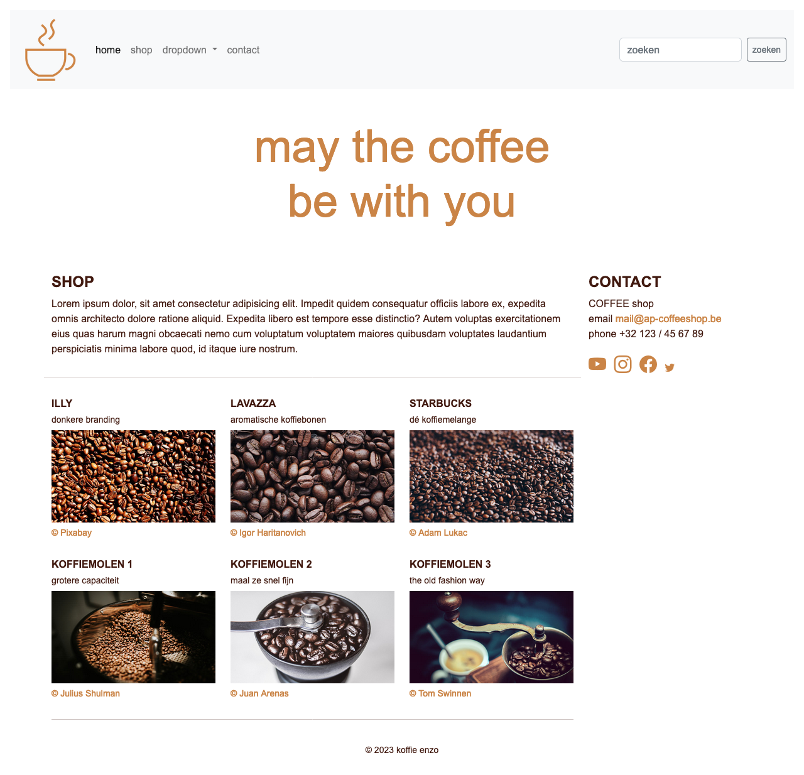
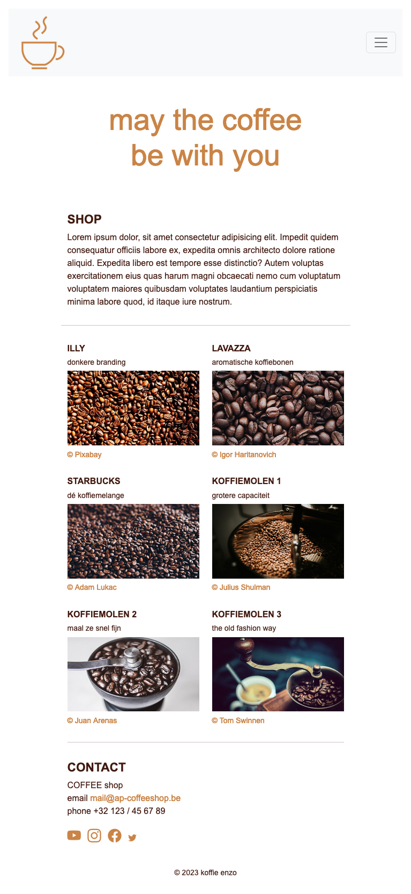
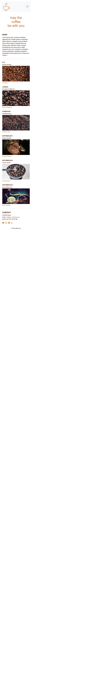

# 💻 05. Bootstrap & content > oefening 01

## 🛠️ opdrachten

### `index.html` openen

 - [ ] Open het bestand genaamd [`index.html`](index.html).

### `style.css` koppelen

- [ ] Koppel de eigen css uit [`style.css`](css/style.css) aan de HTML.
    - `./css/style.css` en gebruik de klasse `themed-container` voor section

### bekijk de Bootstrap cheatsheet

- [ ] open de [Bootstrap cheatsheet](https://getbootstrap.com/docs/5.3/examples/cheatsheet/). Gebruik de dev-tools van je browser om de elementen te inspecteren.
- [ ] Open de [Bootstrap icons](https://icons.getbootstrap.com/). Klik op een icoontje om te leren hoe je het icoontje gebruikt op een Bootstrap-webpagina.

### voorbeeld namaken

- [ ] Maak de printscreens zo goed mogelijk na.

#### head

- [ ] Voeg de `style.css` uit de map css toe.

#### nav

- [ ] Nav heeft een klasse navbar.
- [ ] De navbar vergroot bij het breakpoint md.
- [ ] De navbar heeft een lichte achtergrond.
- [ ] div heeft een container van `100%` breed.
- [ ] Het logo `coffee.png` zit in een klasse navbar-brand.
- [ ] Alle list-items behoren tot de klasse nav-item en hebben een nav-link.
- [ ] De dropdown heeft een klasse dropdown-menu met dropdown-items.
- [ ] De button heeft een kleine button en heeft een grijze omtrek.

#### header
- [ ] De header staat in een rij.
- [ ] h1 heeft een kolom, een gecentreerde tekst en een koffiebruine kleur  .
_(tip: zie ./css/style.css)_

#### main
- [ ] Main heeft een klasse col met breakpoint md die 9 fracties omvat.
- [ ] Het artikel heeft een klasse col met 12 fracties, en een marge onderaan van 3.
- [ ] De ondertitel (h2) staat in hoofdletters, heeft een font-size 4, de font-weight is bolder en heeft een padding-top van 3.
- [ ] Alle 6 artikels met klasse shop-items zijn bij minder dan 576px 12 fractie breed, bij het breakpoint sm zijn ze 6 fracties breed, en bij md 4 fracties.
- [ ] De h2 van het shop-item staat in hoofdletters, heeft een font-size 6, de font-weight is bolder en heeft een padding-top van 3.
- [ ] De afbeelding binnen de figure zijn responsief.
- [ ] De figcaption heeft een klasse kleine h6 en een marge bovenaan van 2.

#### aside
- [ ] Aside heeft een klasse col met een breakpoint md met 3 fracties.
- [ ] h2 van contact heeft dezelfde klasse als h2 shop.
- [ ] De list-items staan inline.
- [ ] De iconen hebben een font-size van 3 en een koffiebruine kleur.

#### footer
- [ ] De container is 100% breed en heeft een padding van 4.
- [ ] De tekst in gecentreerd.
- [ ] De tekst heeft een kleine h6.

#### screenshots

